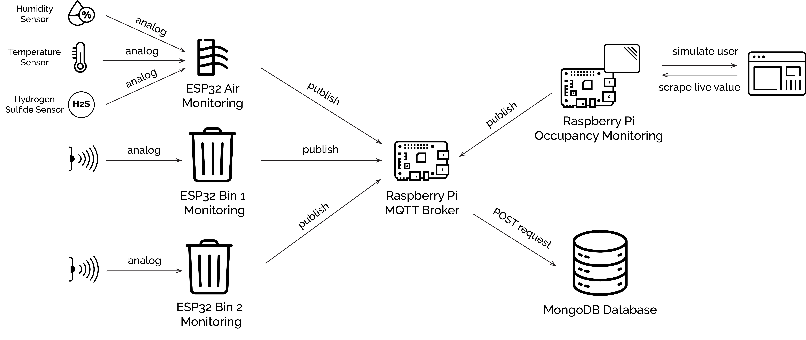

# DE4-SIOT

## Description

Arduino code for data acquisition and Python script for data processing by Colin Laganier as part of DE4 Sensing & Internet of Things. The data was acquired by using two ultrasounds sensors placed in bins, as well as a Hydrogen Sulfide sensor and a temperature and humidity sensor. The ESP32s were connected to an MQTT network, with a Raspberry Pi served as the MQTT broker running with Mosquitto. The scraping algorithm used to calculate the room occupancy was access through Imperial College.

## Hardware

  

-ESP32 (x3)

-Raspberry Pi

-DHT11 sensor

-MQ-136 gas sensor

-HC-SR04 ultrasonic sensor (x2)

## Libraries

-Pandas v1.3.4

-NumPy v1.21.4

-Matplotlib v3.5.0

-PyMongo v4.0.1

-SciPy v1.3.3

-Scikit-learn v0.22.2

-Seaborn v0.11.2

## Datasets

The raw sensor and pre-processed datasets can be found in [Data_Processing/Export_Data](Data_Processing/Export_Data).

The dashboard can be accessed on [my personal website](http://colinlaganier.com/siot)
